# template-avalonia-linux

Linux の x64 機のキオスク端末向けの Avalonia アプリの雛形。

## 🖥️ 画面

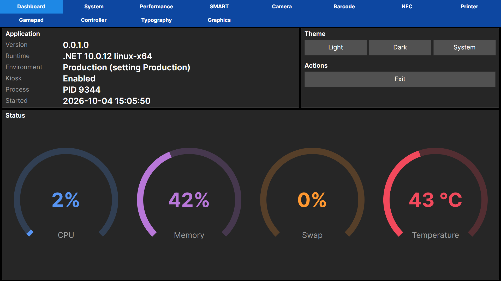

- アプリの情報(版・ランタイム・環境・キオスク・起動の時刻)
- CPU・メモリー・スワップ・温度のゲージ、テーマの切り替え・終了

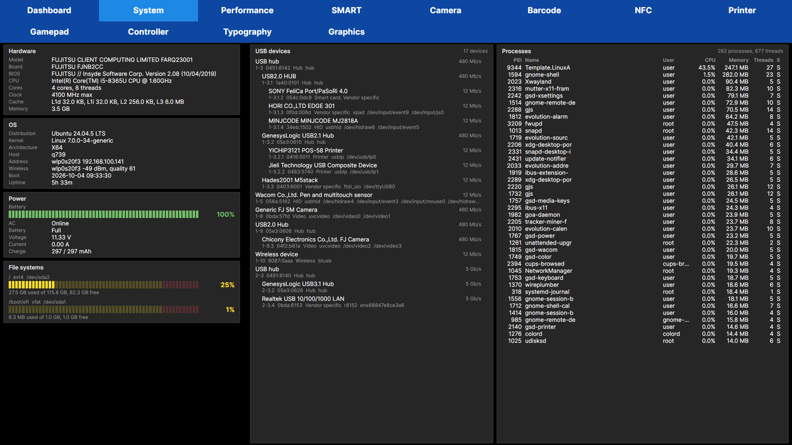

- ハードウェア・OS・電源・ファイルシステムの使用率
- USB 機器のつながり(ドライバー・デバイスファイル)と抜き差し、プロセスの一覧

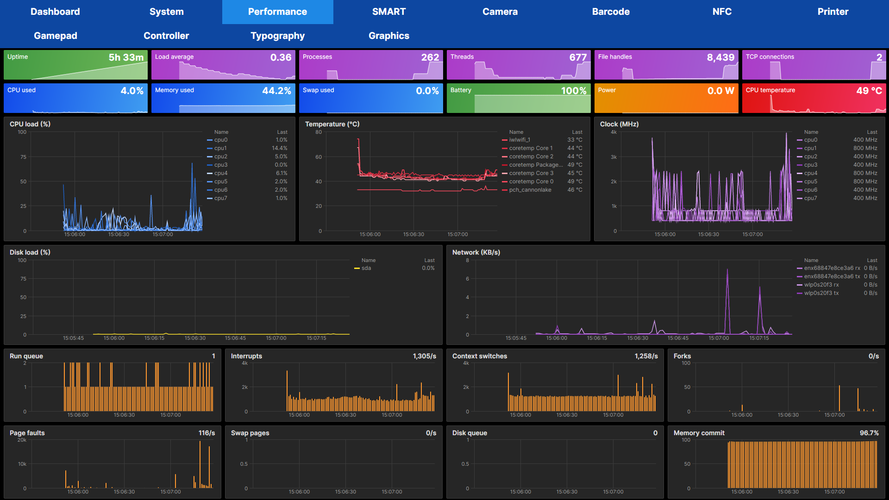

- 稼働時間・負荷・CPU・メモリー・電力などの数値パネルと 120 秒のトレンド
- コアごとの使用率・クロック、温度、ディスク、ネットワークの折れ線、カーネルの統計の棒グラフ

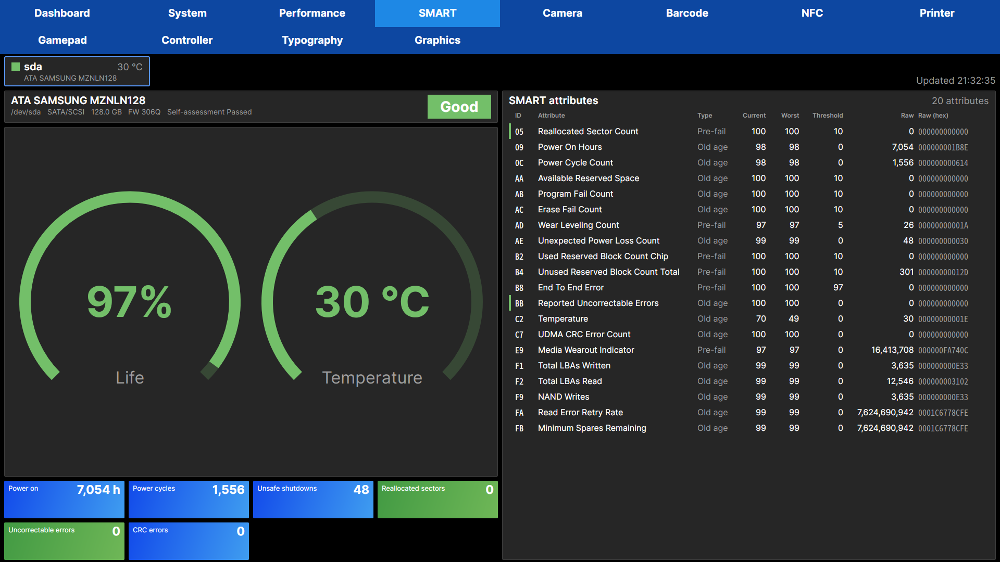

- ディスクごとの SMART の判定・寿命・温度・主な値
- 属性の現在値・最悪値・しきい値・生の値の一覧

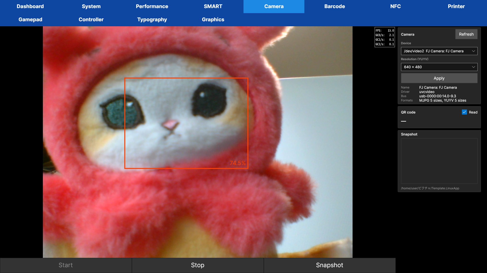

- カメラの映像、形式と解像度の切り替え、顔の検出、QR の読み取り、静止画

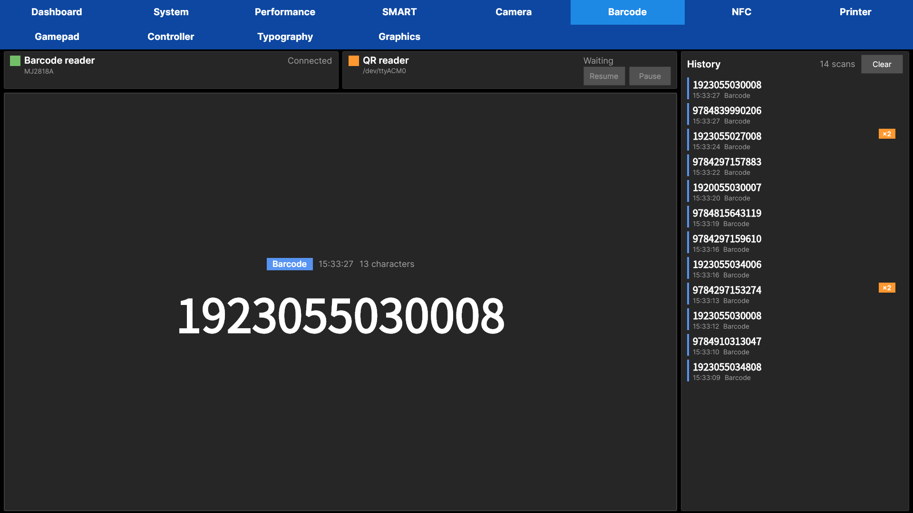

- バーコードリーダーと QR リーダーの読み取り、履歴と重複の回数

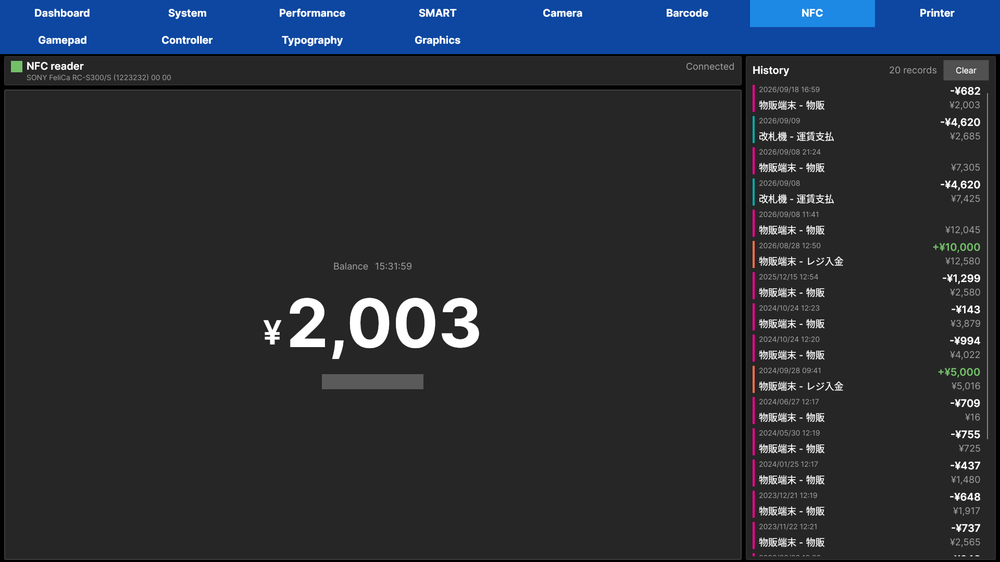

- Suica の残高と利用履歴(PC/SC のリーダー)

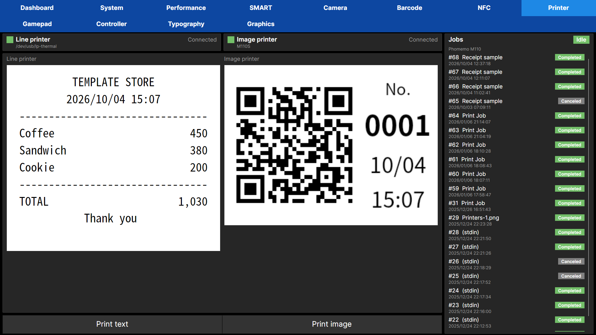

- ライン プリンターと CUPS のプリンターの状態・ジョブ
- レシートとラベルの見本のプレビューと印刷

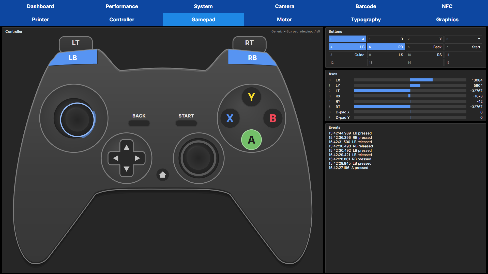

- パッドのボタン・スティック・トリガーの押下
- ボタンと軸の生の値、スティックのずれ(デッドゾーン 8% の円と拡大表示)、直近の入力

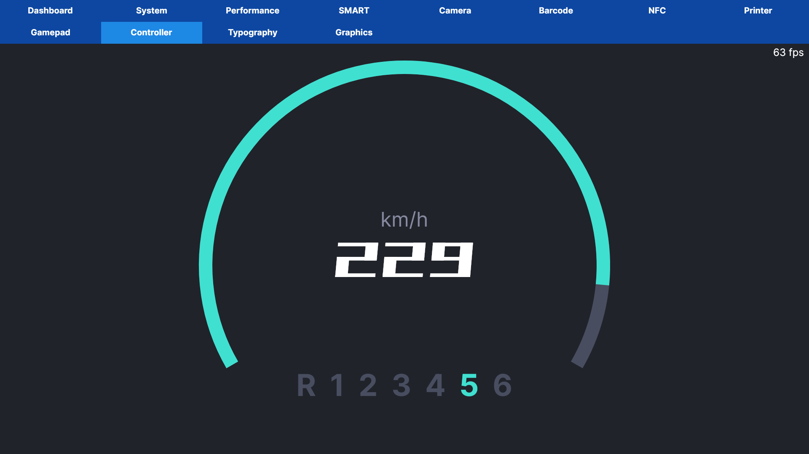

- パッドで操作する速度計・ギア、サーボと LED への送信

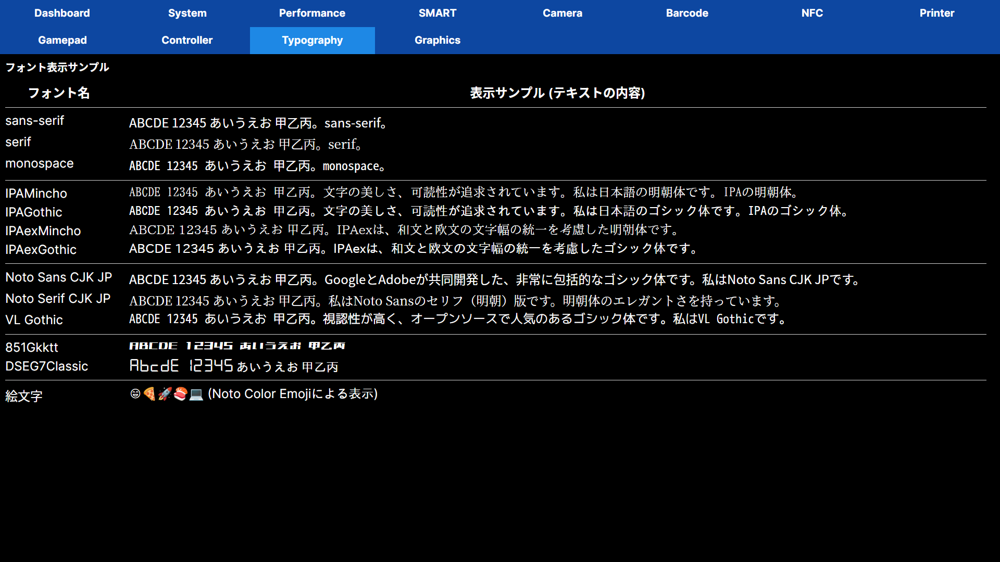

- 各種フォント、絵文字

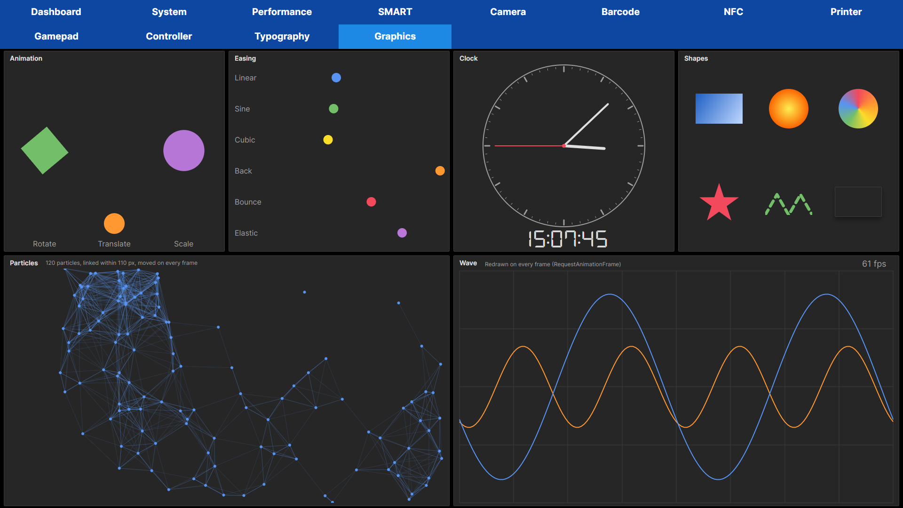

- アニメーション・イージング・アナログ時計・図形・パーティクル・毎フレーム描く波形・fps
